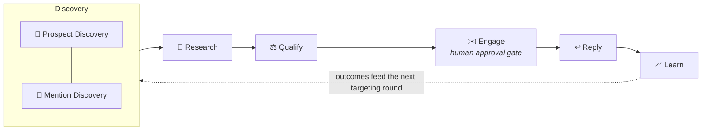

<div align="center">

# 🧭 AI Business Development Platform

### Evidence-first AI Prospecting & Signal Intelligence

**Discover, research, qualify, engage, and learn — with traceable evidence behind every
recommendation, reproducible scoring, and human-controlled outreach.**

[](https://github.com/WayneChou-bot/ai-bd-platform/actions/workflows/ci.yml)
[](tsconfig.json)
[](package.json)
[](https://ai-bd-platform.vercel.app/)
[](LICENSE)

### **[🚀 Live Demo](https://ai-bd-platform.vercel.app/)**

**English** · [繁體中文](README.zh-TW.md)

</div>

---

> **Status** — Portfolio MVP complete. Zero-key **Demo Mode** is ready for public deployment.
> **Gmail LIVE** is designed for controlled, single-user local use.

This is a **portfolio-grade, single-user system** — deliberately *not* a Salesforce/HubSpot
CRM replacement. Instead of managing a book of business, it answers two questions with
auditable evidence:

1. **Which companies are worth contacting — and why, exactly?**
2. **Who on the public web is talking about my product, brand, or problem space?**

## ✨ What makes it different

| | Principle |
|---|---|
| 🔍 | **Evidence behind every conclusion** — every score, draft claim, and insight links back to a source URL with confidence and observation date |
| 🚫 | **Score withholding** — fewer than 2 evidence items? The platform refuses to score rather than guess |
| 🎲 | **Deterministic, reproducible qualification** — scores come from an auditable formula; the LLM writes the rationale, never the number |
| 💥 | **Visible agent failures** — a FAILED run stays on the board; a retry is its own row, never an overwrite |
| ✋ | **Human-controlled outreach** — nothing is sent without explicit approval; the demo *enforces* the pause, it doesn't narrate it |
| 📡 | **Source → Signal → Evidence separation** — a mention is an event; evidence supports a judgement; the two never blur |
| 🔑 | **Zero-key deterministic demo** — the full story runs end-to-end with no API keys and no external calls |

## 🚀 Quick start (zero-key Demo)

```bash
npm install
npm run dev          # APP_MODE defaults to demo — no keys needed
```

Open http://localhost:3000 → **Agents** → **▶ Start Demo**.

The whole loop plays — Discover → Research → Qualify → Engage → Reply → Learn — including
one deliberately injected source failure with retry. It is a deterministic browser-side
replay of one real agent run (recorded with the mock provider), so it works identically on
serverless deployments and every visitor gets their own copy. The demo **pauses at the
first outreach draft and waits for you to click Approve** — the human approval gate is
enforced, not narrated. Nothing external is ever sent.

## 🔁 The loop



Six agents, each a **business responsibility** — sources are adapters underneath, never
user-facing agents:

| Agent | Responsibility | Notable guarantees |
|---|---|---|
| 🔭 **Discovery** | Find prospect candidates (Tavily search + GitHub + CSV + manual) and public mentions of tracked entities | Controlled sources only; search hits are LLM-screened into real organizations — a page title is never a company; dedupe against existing leads; every query recorded |
| 🔬 **Research** | Fetch a lead's real public pages and produce structured evidence | URL-validated, size/time-capped fetches; content fenced as untrusted before any prompt |
| ⚖️ **Qualification** | Score 5 weighted dimensions from evidence | Deterministic formula; withheld when evidence is insufficient; LLM writes rationale only |
| ✉️ **Outreach** | Draft grounded outreach | Drafts may cite only existing positive evidence; AI-disclosure footer on every send |
| ↩️ **Reply** | Classify inbound replies | Sentiment ≠ intent; low-confidence → `needs human`, never auto-recorded |
| 📈 **Learning** | Recompute insights from outcome rows | Confidence-gated: comparative claims are not generated below a minimum sample, and small samples are labelled *directional* |

## 🧮 Deterministic scoring

```
dimension = 100 × (1 − Π(1 − confidence × 0.9))   for positive evidence
            × Π(1 − confidence × 0.6)              damped by negative evidence

total = product_fit×0.30 + problem_evidence×0.25 + intent_signal×0.20
      + role_relevance×0.15 + data_confidence×0.10
```

The number is recomputable from rows — the evaluation suite regenerates every fixture score
and insight from raw evidence and asserts exact equality.

## 📡 Signal intelligence (spec v0.3)

Track entities (product, repo, person, technology) per project. Mention Discovery searches
the public web for their names, aliases and identifiers, then applies a **deterministic
confidence table** (exact URL +40, repo +40, canonical name +25, alias +15, context topic
+25, third-party link to the entity's domain +25) so a product named "Atlas" doesn't drown in
atlases; pages on the entity's own site are skipped — a vendor talking about itself is not a
mention. Context, sentiment and
intent are classified separately — *"looks great"* is positive sentiment with **no** intent;
*"we are evaluating it"* is neutral sentiment with **high** intent. A mention is never a lead
by itself: a human converts it, and Research folds the signal in as intent evidence — in its
original language.

## 🌐 Modes & maturity

| Mode | Maturity | Use it for |
|---|---|---|
| 🎬 **Demo** | ✅ Recommended | Public portfolio deployment — zero keys, mock LLM, simulated delivery, in-memory data |
| 📮 **Gmail LIVE** | ✅ Verified locally | Single-user local use — real search (Tavily), real LLM, real send/receive through your own Gmail, every send rerouted to `DEMO_RECIPIENT_OVERRIDE` |
| 🧪 **Resend** | ⚠️ Experimental | Adapter exists, but inbound content retrieval and RFC Message-ID reply threading remain future work |

Safety rails in LIVE: keys never reach the browser; addresses are masked on status pages;
without a recipient override the app **refuses to start** unless `ALLOW_REAL_OUTREACH=true`
is set knowingly; without Supabase, data is in-memory and resets on restart (Settings warns).

## ⚙️ Configuration

Copy [`.env.example`](.env.example) to `.env.local`. Demo needs nothing. For Gmail LIVE,
create a Google Cloud OAuth **desktop** client, put its ID/secret in `.env.local`, then run
`npm run gmail:auth` to obtain a refresh token.

| Key | Purpose |
|---|---|
| `APP_MODE` | `demo` (default) or `live` — the only switch; business logic never branches on it |
| `LLM_PROVIDER` / `LLM_MODEL` | exactly one of `openai` / `anthropic` / `google` |
| `SEARCH_API_KEY` | Tavily — enables web prospect discovery and mention scanning |
| `GMAIL_*` | OAuth send/receive through your own mailbox (`npm run gmail:auth`) |
| `DEMO_RECIPIENT_OVERRIDE` | Reroutes **every** send here — the safety valve |
| `SUPABASE_URL` + service key | Optional locally; required for persistent LIVE deployments |

## 🧪 Testing

**107 tests** across four layers in [`tests/`](tests) — unit (scoring, schemas, state machine,
mention engine, strict-schema conversion, search-result screening, demo-recording integrity, mail adapters), agent behaviour (reply
classification, prompt-injection fencing), end-to-end flows (pipeline, engagement, demo
playback with an *asserted* human-approval pause), and evaluation — fixtures are regenerated
from raw rows and compared exactly. Failure visibility is itself under test: a FAILED run
must remain visible after its retry succeeds. All of it runs in CI on every push.

```bash
npm test             # vitest run
npm run typecheck    # strict tsc
npm run lint
```

## 🏗️ Built with

Next.js 16 (App Router) · TypeScript (strict) · Tailwind CSS v4 · Zod contracts on every
agent boundary · Vercel AI SDK (`generateObject` with strict structured outputs) ·
Framer Motion (state-driven animation only) · Recharts · Supabase (optional persistence).

Demo product featured in fixtures: [LLM Wiki Agent](https://github.com/WayneChou-bot/LLM-Wiki-Agent-Workflow-Demo) ·
also by the author: [WareTwin](https://github.com/WayneChou-bot/WareTwin)

## 📄 License

[MIT](LICENSE) © 2026 Wayne Chou
