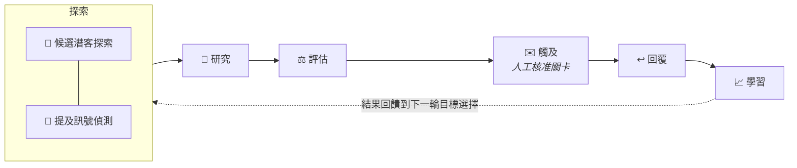

<div align="center">

# 🧭 AI Business Development Platform

### 證據優先的 AI 潛客開發與訊號情報

**探索、研究、評估、觸及、學習 — 每個建議背後都有可追溯的證據、
可重現的評分，以及由人工控制的對外接觸。**

[](#-測試)
[](tsconfig.json)
[](package.json)
[](#-快速開始零金鑰示範)
[](LICENSE)

[English](README.md) · **繁體中文**

</div>

---

> **狀態** — 作品集 MVP 完成。零金鑰的 **Demo 模式**可直接公開部署；
> **Gmail LIVE** 為受控的本機單人使用而設計。多使用者 SaaS 與企業能力刻意不在本版範圍內。

這是一個 **portfolio 等級的單人系統** — 刻意**不是** Salesforce／HubSpot 那種 CRM
替代品。它不管理客戶簿，而是用可稽核的證據回答兩個問題：

1. **哪些公司值得接觸 — 具體原因是什麼？**
2. **公開網路上誰正在談論我的產品、品牌或問題領域？**

## ✨ 差異化特點

| | 原則 |
|---|---|
| 🔍 | **每個結論都有證據** — 每個分數、草稿內容、洞察都能回溯到來源網址，附信心值與觀察日期 |
| 🚫 | **證據不足拒絕評分** — 少於 2 條證據時，平台選擇不給分，而不是亂猜 |
| 🎲 | **確定性、可重現的評估** — 分數來自可稽核的公式；LLM 只寫理由，永遠不碰數字 |
| 💥 | **代理失敗可見** — FAILED 的執行留在看板上；重試是獨立的一列，永不覆蓋 |
| ✋ | **人工控制的觸及** — 未經明確核准不寄出任何訊息；示範中的暫停是強制的，不是旁白 |
| 📡 | **來源 → 訊號 → 證據 分層** — 提及是事件、證據支持判斷，兩者永不混淆 |
| 🔑 | **零金鑰確定性示範** — 完整流程不需任何 API 金鑰、不呼叫任何外部服務 |

## 🚀 快速開始（零金鑰示範）

```bash
npm install
npm run dev          # APP_MODE 預設為 demo — 不需要任何金鑰
```

打開 http://localhost:3000 → **代理** → **▶ 開始示範**。

一個全新的模擬專案會跑完整條迴圈 — 探索 → 研究 → 評估 → 觸及 → 回覆 → 學習 —
包含一次刻意注入的來源失敗與重試。示範會**在第一封觸及草稿處暫停，等你親手按下核准**：
第一封草稿示範人工核准關卡，其餘模擬草稿自動推進以維持節奏。全程不會寄出任何真實訊息。

## 🔁 主迴圈



六個代理，每個都是一項**商業職責** — 來源是底層的 adapter，永遠不會變成介面上的代理：

| 代理 | 職責 | 關鍵保證 |
|---|---|---|
| 🔭 **探索** | 尋找候選潛客（Tavily 搜尋＋GitHub＋CSV＋手動）與追蹤實體的公開提及 | 僅使用受控來源；對既有潛客去重；每個查詢都被記錄 |
| 🔬 **研究** | 抓取潛客的真實公開頁面，產生結構化證據 | 網址驗證、大小／時間上限；內容先圍欄為不可信資料才進 prompt |
| ⚖️ **評估** | 由證據計算五維加權分數 | 確定性公式；證據不足即保留不評；LLM 只寫理由 |
| ✉️ **觸及** | 撰寫有依據的觸及信 | 草稿只能引用既有的正向證據；每封信附 AI 揭露頁尾 |
| ↩️ **回覆** | 分類收到的回信 | 情緒 ≠ 意圖；低信心標記「需要人工」，永不自動記錄結果 |
| 📈 **學習** | 從結果資料列重算洞察 | 信心門檻：樣本低於下限不產生比較型結論，小樣本標示「方向性」 |

## 🧮 確定性評分

```
維度分 = 100 × (1 − Π(1 − 信心 × 0.9))   正向證據累積
          × Π(1 − 信心 × 0.6)             負向證據衰減

總分 = 產品契合×0.30 + 問題證據×0.25 + 意圖訊號×0.20
     + 角色相關×0.15 + 資料信心×0.10
```

數字永遠可以從資料列重算 — 評估測試會從原始證據重新產生每個 fixture 的分數與洞察，
並斷言完全相等。

## 📡 訊號情報（規格 v0.3）

每個專案可定義追蹤實體（產品、Repo、個人、技術）。提及偵測在公開網路搜尋它們的名稱、
別名與識別碼，再套用**確定性信心加分表**（完整網址 +40、Repo +40、正式名稱 +25、
別名 +15、主題吻合 +20、網域吻合 +25）— 產品叫 "Atlas" 也不會被地圖集淹沒。
語境、情緒與意圖分開判定 — 「做得很漂亮」是正面情緒但**沒有**意圖；
「我們正在評估導入」是中性情緒但**高**意圖。提及本身永遠不會自動變成潛客：
由人工轉換，研究代理再把訊號以**原文**併入意圖證據。

## 🌐 模式與成熟度

| 模式 | 成熟度 | 適用情境 |
|---|---|---|
| 🎬 **Demo** | ✅ 建議使用 | 公開作品集部署 — 零金鑰、mock LLM、模擬寄送、記憶體資料 |
| 📮 **Gmail LIVE** | ✅ 本機已驗證 | 單人本機使用 — 真實搜尋（Tavily）、真實 LLM、透過自己的 Gmail 真實寄收，每封信轉送到 `DEMO_RECIPIENT_OVERRIDE` |
| 🧪 **Resend** | ⚠️ 實驗性 | Adapter 已存在，但收信內容擷取與 RFC Message-ID 回信比對仍是未來工作 |

LIVE 的安全防線：金鑰不進瀏覽器；狀態頁遮罩信箱；沒設收件人覆寫時應用程式**拒絕啟動**，
除非明確設定 `ALLOW_REAL_OUTREACH=true`；沒設 Supabase 時資料存在記憶體、重啟即清空
（設定頁會警告）。

## ⚙️ 設定

複製 [`.env.example`](.env.example) 為 `.env.local`。Demo 什麼都不用填。
Gmail LIVE 的逐步教學見 [docs/setup-gmail.zh-TW.md](docs/setup-gmail.zh-TW.md)。

| 變數 | 用途 |
|---|---|
| `APP_MODE` | `demo`（預設）或 `live` — 唯一的開關；業務邏輯永不依它分支 |
| `LLM_PROVIDER` / `LLM_MODEL` | `openai` / `anthropic` / `google` 三選一 |
| `SEARCH_API_KEY` | Tavily — 啟用網路候選探索與提及掃描 |
| `GMAIL_*` | 透過自己的信箱 OAuth 寄收（`npm run gmail:auth`） |
| `DEMO_RECIPIENT_OVERRIDE` | **所有**寄送轉送到此 — 安全閥 |
| `SUPABASE_URL` ＋ service key | 本機選填；持久化 LIVE 部署必填 |

## 🧪 測試

**86 個測試**，分四層 — 單元（評分、schema、狀態機、提及引擎、嚴格 schema 轉換、
郵件 adapter）、代理行為（回覆分類、prompt injection 圍欄）、端到端流程（管線、觸及、
提及掃描→轉換→研究、含**斷言人工核准暫停**的示範播放）、以及評估
（fixture 從原始資料列重新產生並精確比對）。失敗可見性本身也在測試範圍：
測試斷言重試成功後，FAILED 的那一列**仍然存在**。

```bash
npm test             # vitest run
npx tsc --noEmit     # 嚴格型別檢查
npm run lint
```

> 確定性測試證明系統**穩定**。證明情報**品質**（golden dataset、Precision@10、
> Evidence Support Rate）列於 roadmap。

## 🗺️ 刻意不做的範圍

多使用者 SaaS（認證、工作區、RBAC、RLS）、durable job queue（重試＋dead-letter）、
完整 Resend 收信路徑、真正的 campaign／sequence 模型、CRM 同步、人工標註品質評估 —
這些差距都已理解，並且刻意延後。這是 portfolio 等級的單人系統；硬塞半套 Auth
只會讓它更差，不會更好。

## 🏗️ 技術棧

Next.js 16（App Router）· TypeScript（strict）· Tailwind CSS v4 · 每個代理邊界都有
Zod 契約 · Vercel AI SDK（`generateObject` 嚴格結構化輸出）· Framer Motion
（僅 state 驅動的動畫）· Recharts · Supabase（選用持久化）。

Fixture 中的示範產品：[LLM Wiki Agent](https://github.com/WayneChou-bot/LLM-Wiki-Agent-Workflow-Demo) ·
作者的另一個專案：[WareTwin](https://github.com/WayneChou-bot/WareTwin)

## 📄 授權

[MIT](LICENSE) © 2026 Wayne Chou
